LAGRANGE.AI

Lagrange.AI

**\**

Version 1.0

> This User Manual provides a step-by-step guide to using the
> Lagrange.AI platform for supply chain analytics. It covers user
> authentication, workspace creation and management, and model
> analytics, including configuration, execution, and dashboard
> reporting.

# Table of Contents {#table-of-contents .TOC-Heading}

[1. Authentication & User Management
[4](#authentication-user-management)](#authentication-user-management)

[1.1 Introduction [4](#introduction)](#introduction)

[1.2 Sign-in Process [4](#sign-in-process)](#sign-in-process)

[1.3 Password Management
[4](#password-management)](#password-management)

[1.3.1 Forgot Password [4](#forgot-password)](#forgot-password)

[1.4 User Invitation System
[5](#user-invitation-system)](#user-invitation-system)

[1.4.1 Accepting Organization Invitations
[5](#accepting-organization-invitations)](#accepting-organization-invitations)

[1.5 Role-Based Access Control
[7](#role-based-access-control)](#role-based-access-control)

[1.5.1 User Roles & Permissions
[7](#user-roles-permissions)](#user-roles-permissions)

[1.5.2 How Roles Work [7](#how-roles-work)](#how-roles-work)

[1.6 Session Security Management
[7](#session-security-management)](#session-security-management)

[1.6.1 Auto-Lockout Timer [7](#auto-lockout-timer)](#auto-lockout-timer)

[1.7 Session Persistence
[7](#session-persistence)](#session-persistence)

[1.8 Common Scenarios [8](#common-scenarios)](#common-scenarios)

[1.8.1 First-Time User [8](#first-time-user)](#first-time-user)

[1.8.2 Returning User [8](#returning-user)](#returning-user)

[1.8.3 Password Reset Flow
[8](#password-reset-flow)](#password-reset-flow)

[1.9 Quick Tips [8](#quick-tips)](#quick-tips)

[2. Model Analytics & Management
[9](#model-analytics-management)](#model-analytics-management)

[2.1 Overview [9](#overview)](#overview)

[2.2 Base Model Management
[9](#base-model-management)](#base-model-management)

[2.3 Analytics Configuration
[9](#analytics-configuration)](#analytics-configuration)

[2.4 Name Your Configuration
[9](#name-your-configuration)](#name-your-configuration)

[2.5 Select an Analytics Module
[10](#select-an-analytics-module)](#select-an-analytics-module)

[2.6 Network Optimization Overview
[10](#network-optimization-overview)](#network-optimization-overview)

[2.6.1 Echelons in the Network
[10](#echelons-in-the-network)](#echelons-in-the-network)

[2.7 Objective Components
[11](#objective-components)](#objective-components)

[2.8 Network Structure [11](#network-structure)](#network-structure)

[2.9 Distance Type [11](#distance-type)](#distance-type)

[2.10 Optimization Constraints
[12](#optimization-constraints)](#optimization-constraints)

[2.11 KPI Performance Comparison [13](#_Toc207630191)](#_Toc207630191)

[2.12 Required Data [13](#required-data)](#required-data)

[2.13 Analytics Configuration
[14](#analytics-configuration-1)](#analytics-configuration-1)

[2.14 Required Data List [14](#required-data-list)](#required-data-list)

[2.14.1 Table Columns and Actions
[14](#table-columns-and-actions)](#table-columns-and-actions)

[2.14.2 Batch Upload [15](#batch-upload)](#batch-upload)

[2.14.3 Batch Processing [15](#batch-processing)](#batch-processing)

[2.14.4 Interactive Composer
[16](#interactive-composer)](#interactive-composer)

[2.14.5 Compose [23](#compose)](#compose)

[2.14.6 Upload [23](#upload)](#upload)

[2.15 Required Data List Status and Analytics Activation
[23](#required-data-list-status-and-analytics-activation)](#required-data-list-status-and-analytics-activation)

[2.16 Execution Monitoring
[25](#execution-monitoring)](#execution-monitoring)

[2.16.1 Execution List [27](#execution-list)](#execution-list)

[2.17 Accessing Model Dashboards
[28](#accessing-model-dashboards)](#accessing-model-dashboards)

[2.17.1 Dashboards List [28](#dashboards-list)](#dashboards-list)

[2.17.2 Dashboard View [29](#dashboard-view)](#dashboard-view)

[2.17.3 Dashboard Editing [29](#dashboard-editing)](#dashboard-editing)

[2.17.4 Add New Chart [30](#add-new-chart)](#add-new-chart)

[3. Workspace Management
[32](#workspace-management)](#workspace-management)

[3.1 Overview [32](#overview-1)](#overview-1)

[3.2 Welcome Interface [32](#welcome-interface)](#welcome-interface)

[3.3 Workspace Display [32](#workspace-display)](#workspace-display)

[3.4 Workspace Actions [33](#workspace-actions)](#workspace-actions)

[3.5 Quick Access [33](#quick-access)](#quick-access)

[3.6 Workspace Creation [33](#workspace-creation)](#workspace-creation)

[3.7 Organization Settings
[34](#organization-settings)](#organization-settings)

[3.8 Overview [34](#_Toc207630217)](#_Toc207630217)

[3.9 Workspace Management
[35](#workspace-management-1)](#workspace-management-1)

[3.10 User Management [35](#user-management)](#user-management)

[3.11 Policies [36](#policies)](#policies)

[3.12 Common Workflows [36](#common-workflows)](#common-workflows)

[3.12.1 Creating New Workspace
[36](#creating-new-workspace)](#creating-new-workspace)

[3.12.2 Accessing Workspace
[36](#accessing-workspace)](#accessing-workspace)

[3.12.3 Managing Members [36](#managing-members)](#managing-members)

[3.13 Common Issues & Solutions
[36](#common-issues-solutions)](#common-issues-solutions)

# 1. Authentication & User Management

## 1.1 Introduction

This platform is designed to optimize supply chain management, helping
organizations track, manage, and analyze their operations efficiently.
Users can collaborate within organizations, manage workspaces, create
and monitor models, and gain insights from dashboards to improve
decision-making across the supply chain.

## 1.2 Sign-in Process

When you access the platform, you'll be directed to the Sign-In Page
where you can:

- Enter your credentials (Email or Username+ Password)

- Complete reCAPTCHA (security verification)

- Use \'Remember Me\' option to stay logged in

- Recover your password via the \'Forgot Password?\' link

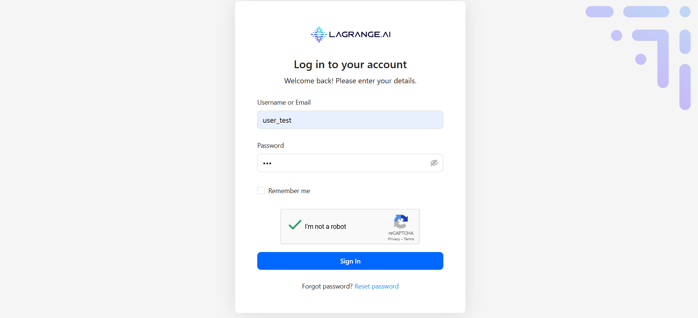{width="2.9479166666666665in"
height="3.8084634733158356in"}
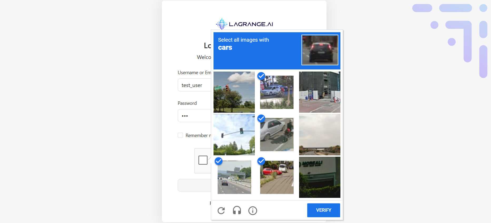{width="2.885650699912511in"
height="3.804866579177603in"}

## 1.3 Password Management

### 1.3.1 Forgot Password

1.  Click \'Forgot Password? Reset Password\' on the sign-in page

2.  Enter your registered email address

3.  Receive a reset link via email (expires after a set time)

4.  Follow the link to continue

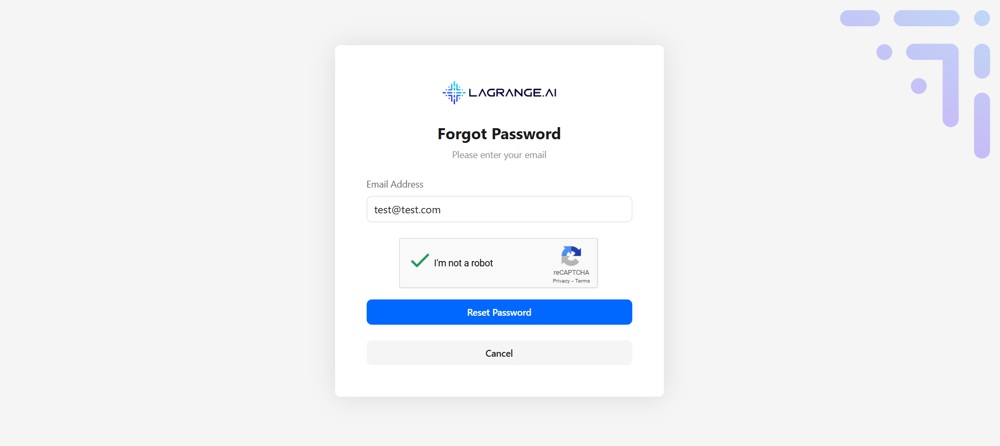{width="3.5528576115485566in"
height="3.81in"}

## 1.4 User Invitation System

### 1.4.1 Accepting Organization Invitations

1.  Receive an email with an invitation link

2.  Click the link to open the acceptance page

3.  Verify your identity (create account or sign in)

4.  Join the organization with an assigned role

5.  Access granted → redirected to your workspace

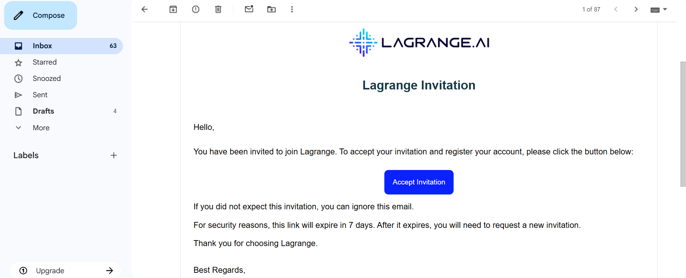{width="6.0762740594925635in"
height="2.470596019247594in"}

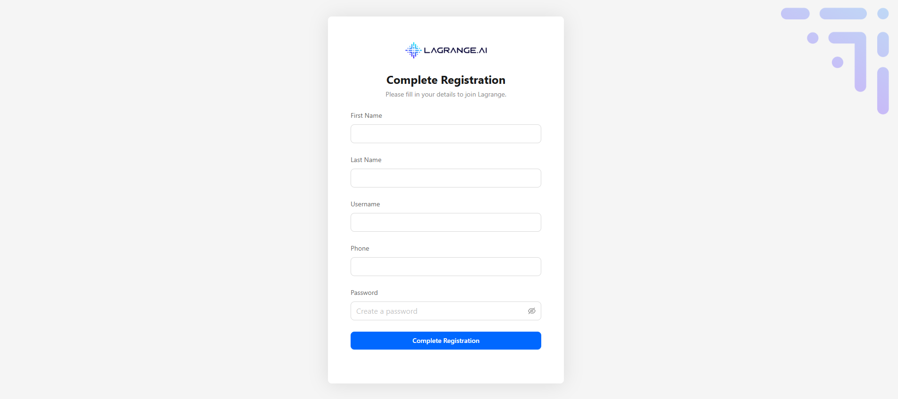{width="2.2460728346456693in"
height="4.092691382327209in"}

## 1.5 Role-Based Access Control

### 1.5.1 User Roles & Permissions

Organization Admin

- Full access to organization settings

- Manage users, and workspaces

- Access subscription

- Configure policies

- View analytics and reports

Organization User

- Access assigned workspaces

- Create and manage models

- View dashboards

- Manage personal settings only

### 1.5.2 How Roles Work

- Automatic Role Assignment (based on invitation or setup)

- Permission Enforcement (UI adapts to your role)

- Protected Routes (unauthorized users are redirected)

- Role Indicators (your role appears in settings)

## 1.6 Session Security Management

### 1.6.1 Auto-Lockout Timer

1.  System tracks your last activity

2.  After 15--30 mins idle, you'll get a warning

3.  If still idle → screen locks (password required)

4.  Longer inactivity → complete logout

> Tip: Any mouse or keyboard activity keeps your session active

## 1.7 Session Persistence

Remember Me Feature

- Stay logged in between browser sessions

- Secure token stored locally

- Auto re-authentication on return

- Disable on shared devices

Multi-Device Support

- Sign in on multiple devices

- Each session tracked separately

- Security dashboard shows active sessions

- Remotely sign out from other devices

## 1.8 Common Scenarios

### 1.8.1 First-Time User

1.  Open invitation email

2.  Click the invitation link

3.  Create account with strong password

4.  Verify email (if required)

5.  Join organization automatically

6.  Complete profile setup

### 1.8.2 Returning User

1.  Open platform URL

2.  Enter email + password

3.  Complete reCAPTCHA if shown

4.  Access your workspaces

5.  Continue where you left off

<!-- -->

1.  Screenshot Example: \[Insert screenshot here\]

### 1.8.3 Password Reset Flow

1.  Click \'Forgot Password\'

2.  Enter email address

3.  Receive reset link (valid for limited time)

4.  Click the link

5.  Create a new password

6.  Sign in with new credentials

## 1.9 Quick Tips

- Bookmark the Sign-In Page for easy access

- Use a password manager for safe storage

- Enable notifications for important alerts

- Review permissions in User Settings

- Contact support if you have login issues

- Check your spam folder for invitation or reset emails

# 2. Model Analytics & Management

## 2.1 Overview

The Model Analytics & Management system is the core engine of the
Lagrange platform, enabling you to create, configure, and analyze supply
chain models. This feature helps optimize your supply chain network
through data-driven insights.

{width="5.856060804899387in"
height="2.631837270341207in"}

## 2.2 Base Model Management

Location: Access via main navigation → Select workspace → \'Base Model\'
section

Base Model is the primary template and source of truth for all
sub-models. Steps to View Base Model:

- Navigate to workspace homepage

- Click \'Base Model\' in navigation

- View overview: Number of products, nodes, total demand, sub-model
  count

## 2.3 Analytics Configuration

Manage predefined analytics scenarios, reusable settings, and parameter
sets. Steps:

- Create new configuration: name, analytics type, parameters, required
  data

##  2.4 Name Your Configuration

Enter a descriptive name that clearly reflects the settings selected for
this configuration, which will determine how analytics are run.

{width="5.468650481189851in"
height="2.4469695975503063in"}

## 2.5 Select an Analytics Module

Choose one of the available analytics modules for this configuration. In
this example, we select the Network Optimization []{dir="rtl"}Analytics
to define which analysis will be executed.

{width="5.537878390201225in"
height="2.468970909886264in"}

## 

## 2.6 Network Optimization Overview

Network optimization focuses on finding the best structure for a supply
chain or logistics network. The goal is to determine where flows should
go and how much should be transported across the network in order to
minimize cost.

### 2.6.1 Echelons in the Network

Supply chains can be modeled with different levels (called echelons)
depending on the number of stages between suppliers and customers:

**Single-echelon**

- Involves warehouses or distribution centers (DCs) and customers.

- The problem is to decide how customer demand should be served from
  available DCs.

**Two-echelon**

- Includes factories, warehouses/DCs, and customers.

- Here, the model decides not only how to serve customers but also how
  products should flow from factories to warehouses.

**Three-echelon**

- Consists of suppliers, factories, warehouses/DCs, and customers.

- This is a more complete view of the supply chain, where raw materials
  flow from suppliers to factories, are processed into products, and
  then distributed through warehouses/DCs to customers.

## 2.7 Objective Components

Select the key elements that should be included in the optimization
objective function. These components will guide the analytics in
evaluating and improving your supply chain network.

{width="5.401514654418198in"
height="2.440683508311461in"}

## 2.8 Network Structure

Please select supply chain node types you would like to include in the
model. This means you should choose the kinds of elements (nodes) that
exist in your supply chain network --- for example, suppliers,
factories, warehouses, distribution centers, and customers. These define
the structure of your network model.

## 2.9 Distance Type

Choose how distances between locations should be calculated. Straight
Distance → The direct "as-the-crow-flies" distance between two points.
Driving Distance → The actual road distance based on driving routes.
Basically: Straight distance is geometric (shortest line), while driving
distance is practical (real-world travel on roads).

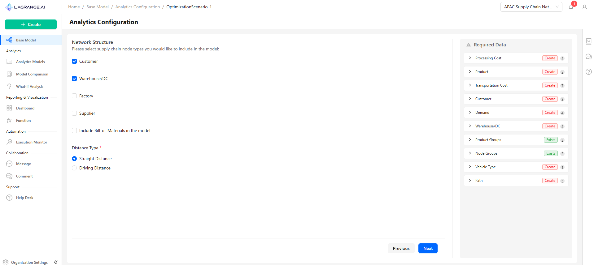{width="5.439394138232721in"
height="2.430729440069991in"}

## 2.10 Optimization Constraints

Select the constraint types to include in your network optimization:

- Capacity

- Storage

- Production

- Supply

- Product Flow

- Vehicle

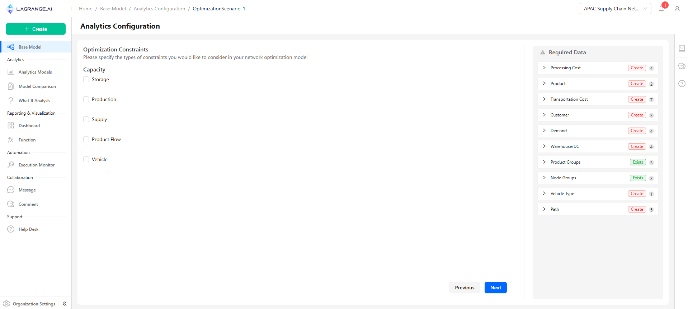{width="5.712121609798775in"
height="2.5764031058617674in"}

[]{#_Toc207630191 .anchor}**2.11 KPI Performance Comparison**\
Evaluate your current supply chain against the optimized model. Choose
the metrics you'd like to analyze:

- Select All Metrics

- Weighted Distance Traveled

- Distance Traveled

- Transportation Cost

- Production Cost

- Processing Cost

- Supply Cost

- Total Revenue

{width="5.636363735783027in"
height="2.5357108486439195in"}

## 2.12 Required Data

At each step, you can view the required datasets on the left side of the
page. Selecting a feature will automatically update the corresponding
requirements.

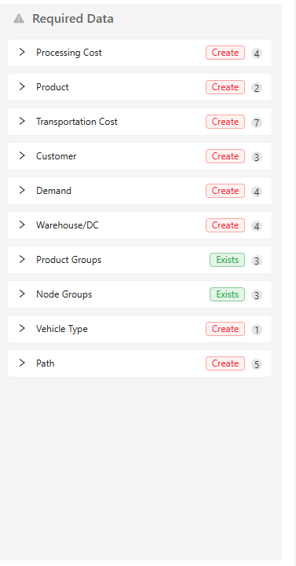{width="2.1092465004374454in"
height="2.854963910761155in"}

## 2.13 Analytics Configuration 

This page allows you to manage all your analytics configurations in a
centralized view. You can track when each configuration was last
modified, monitor the status of required datasets, and perform key
actions such as running analytics, exporting configurations in JSON
format, or deleting them. It provides a clear overview to help you
efficiently manage and maintain your analytics workflows.

{width="5.621211723534558in"
height="2.5223884514435695in"}

## 2.14 Required Data List 

Clicking on a Required Data List opens the page where you can view all
the tables needed for the selected analytics configuration. Each table
shows the required fields, current status, last modified date, and
available actions such as Upload, Compose, or Download Template. This
allows you to manage and prepare all necessary datasets before running
analytics.

### 2.14.1 Table Columns and Actions

- **Table Name** → The name of the dataset required for analytics.

- **Action Type** → Indicates whether the table needs to be created or
  already exists.

- **Required Fields** → Lists all mandatory fields that must be provided
  for the table.

- **Status** → Current state of the data (Pending, Complete, Needs
  Attention, etc.).

- **Last Modified Date** → The last time the table was updated.

- **Actions**:

  - **Upload** → Add data files to this table.

  - **Compose** → Build or edit data directly within the platform.

  - **Download Template** → Download a pre-formatted template for data
    entry.

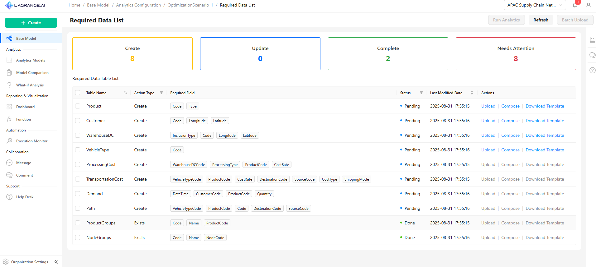{width="5.901514654418198in"
height="2.6515857392825897in"}

### 2.14.2 Batch Upload

You can select multiple tables at once and use the Batch Upload option
at the top of the page to upload all selected datasets
together[.]{dir="rtl"}

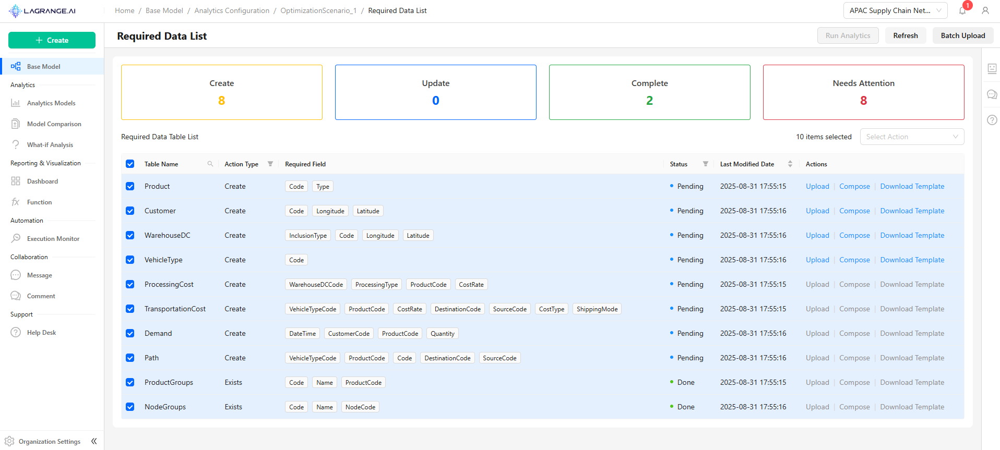{width="5.954545056867891in"
height="2.680923009623797in"}

### 2.14.3 Batch Processing

Create Tables -- Batch Upload: On this page, you can upload all required
tables in the priority order needed for your analytics configuration.
All tables should be included in a single Excel file, with each table on
a separate sheet following the provided template, which you can download
directly from this page.

You also have the option to **Use Existing Data**, which allows you to
skip uploading new files and use data you previously uploaded. Note that
only files containing all the selected tables can be used.

{width="5.909091207349081in"
height="2.6556714785651794in"}

For uploading, you can choose between two action types:

- **Overwrite Existing Data** → Replace any previous data with the new
  upload.

- **Insert Rows at the End (Append)** → Add the new data to the end of
  the existing data.

To upload, you can either click or drag your Excel file into the
designated area. Support is provided for single or bulk file uploads.
Ensure that uploaded files are correctly formatted and do not contain
company-restricted or unrelated data.

{width="5.712121609798775in"
height="2.558555336832896in"}

### 2.14.4 Interactive Composer

For each table in your analytics configuration, the data preparation
process is divided into several phases to ensure your datasets are
accurate, complete, and ready for analytics:

- **Phase 1: Data Labeling** -- Map source data fields to the
  corresponding model table fields. Only the required fields need to be
  labeled.

- **Phase 2: Data Verification** -- Check the mapped data for
  correctness and completeness.

- **Phase 3: Data Consistency** -- Ensure all related data across tables
  is consistent.

- **Phase 4: Summary and Metrics** -- Review overall status, identify
  issues, and confirm readiness for analytics.

**Phase 1: Data Labeling**

Data Labeling is the first step in preparing your tables for analytics.
In this phase, you map the columns from your source data to the fields
in the corresponding model table. This ensures that the system correctly
understands your data before moving on to verification and consistency
checks.

**How it Works:**

- Each required field in the model table (e.g., Code, Latitude,
  Longitude) must be mapped to a column in your uploaded data.

- Optional fields can be skipped or labeled if needed.

**Available Options for Each Field:**

1.  **Use the same field** → Directly map the source column to the model
    field.

2.  **Use another field** → Select a different column from the source
    file to map.

3.  **No Labeling** → Skip optional fields that don't require mapping.

4.  **Ignore** → Exclude fields that are not needed in this table.

**Tips:**

- Only fields required for this action need to be labeled.

- Correct labeling is critical because all subsequent phases
  (verification, consistency checking, and summary) rely on these
  mappings.

- Double-check that all required fields are mapped to avoid errors
  later.\"

{width="5.696969597550306in"
height="2.5636351706036744in"}

In addition to manual field mapping, the system can assist you using
**AI-powered labeling suggestions**. Based on the source data and model
table structure, the AI analyzes your data and automatically proposes
mappings for each field.

**Phase 2: Data Verification**

Validate labeled data to ensure accuracy, completeness, and consistency
for analytics.

{width="5.856060804899387in"
height="2.6331933508311463in"}

**How it Works:**

- The system checks each field for missing values, incorrect types,
  invalid formats, or constraint violations.

- Detected issues are displayed with field name, type, and occurrence
  count.

- The system provides a **default treatment**, and when you select
  **Change**, you can see and apply other treatment options based on the
  data.

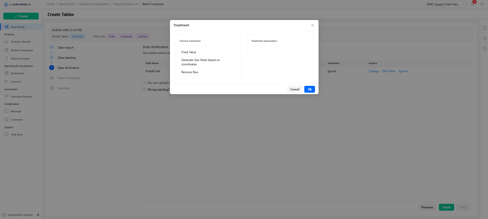{width="5.871211723534558in"
height="2.64748031496063in"}

**Available Actions:**

- **Ignore** -- Skip non-critical issues

- **Change** -- View and apply alternative treatments suggested by the
  system

- **Edit Inline** -- Correct data directly

{width="5.909091207349081in"
height="2.6782403762029747in"}

**Verification Rules:**

- Field-Level: Nullable, Unique, Data Type, Format, Value Range

- Content-Based: Pattern Matching, Length, Enumeration, Cross-Reference

**Workflow:**

1.  Select a verification issue and apply a treatment.

2.  Click **Check** to apply the verification updates to the dataset.

3.  Once all verification steps are applied, the **Next** button becomes
    active.

4.  Proceed to **Phase 3: Data Consistency**.

{width="5.939394138232721in"
height="2.676166885389326in"}

**Tips:** Correct issues before moving to the consistency phase.

**Phase 3: Data Consistency**

Ensure that the dataset complies with business rules and maintains
integrity across multiple fields and external references. This phase
checks relationships between fields and with other tables to prevent
errors in analytics.

{width="5.689394138232721in"
height="2.5490321522309713in"}

**How it Works:**

The system validates foreign key references and cross-field
dependencies.

- Detected inconsistencies are displayed with field name, type, number
  of occurrences, and suggested treatments.

- If any issues remain unresolved, you can upload a new file to restart
  the process or adjust the previous labeling.

**Consistency Checks Include:**

- External Reference Consistency: Verify that all foreign key references
  exist in related tables.

- Cross-Field Validation: Ensure logical relationships between multiple
  fields are maintained.

- Business Rule Validation: Confirm adherence to company-specific rules
  or constraints.

**Available Actions:**

- **Edit Inline**: Correct inconsistent data directly in the table.

- **Remove Rows**: Delete records that violate critical consistency
  rules.

- **Change**: View other recommended treatments based on system
  suggestions.

**Workflow:**

1.  Review inconsistencies detected by the system.

2.  Apply a treatment (Edit Inline, Remove Row, or Change).

3.  Click Check to apply consistency updates.

4.  Once all issues are resolved, the Next button becomes active.

5.  Proceed to Phase 4: Summary and Metrics.

**Tips:**

- Resolve inconsistencies before moving forward to ensure accurate
  analytics.

- Use the Change option to explore suggested treatments for complex
  inconsistencies.

- If labeling mistakes were carried over from previous phases, correct
  them here before continuing.

**Phase 5: Summary**

The Summary phase provides an overall assessment of the data preparation
process by presenting key quality metrics and final processing results.
This allows you to evaluate the effectiveness of labeling, verification,
and consistency checks.

{width="6.136363735783027in"
height="2.7727274715660544in"}

**Data Quality Metrics:**

- **Completeness Metrics**:

  - Required Fields Completeness: Percentage of required fields with
    valid data.

  - Optional Fields Completeness: Percentage of optional fields
    populated.

  - Overall Completeness Rate: Percentage of total fields populated.

- **Validity Metrics:**

  - Data Validity: Percentage of data passing verification rules.

  - Format Validity: Percentage of fields meeting format requirements.

  - Constraint Compliance: Percentage of records satisfying database
    constraints.

- **Accuracy Metrics**:

  - Data Accuracy: Percentage of correctly mapped and transformed data.

  - Mapping Accuracy: Percentage of fields correctly mapped.

  - Transformation Accuracy: Percentage of successful data
    transformations.

- **Consistency Metrics**:

  - Data Consistency: Percentage of data passing business rule
    validation.

  - Cross-Field Consistency: Percentage of records with consistent
    cross-field values.

  - Reference Integrity: Percentage of records with valid external
    references.

**Workflow:**

1.  Review the summary metrics to assess data quality and completeness.

2.  If any issues are detected, you can choose to **stop** and correct
    the data before proceeding.

3.  Once satisfied, click **Next** to move to the subsequent table in
    the batch.

4.  Repeat Phases 1--5 for each table until all selected tables are
    fully processed and verified.

**Tips:**

- The summary allows a quick check of how well each table meets data
  quality standards.

- Ensure all required fields are complete and consistency is maintained
  before finalizing the batch.

- Use this stage to validate that all uploaded data is ready for
  analytics execution.

### 2.14.5 Compose

The compose process follows the same steps as batch upload, but instead
of handling all files at once, it processes each file individually.

###  2.14.6 Upload

The upload process also follows the same steps, but everything is
executed automatically and much faster for all files together.

## 2.15 Required Data List Status and Analytics Activation

Once all tables in the **Required Data List** show a **"Done"** status
and all required fields are correctly uploaded and validated, the **Run
Analytics** button at the top of the page becomes **active**. You can
then run the selected analytics on your model. Options include:

- Click **Run Analytics** from the **Base Model** page and select the
  desired configuration.

- Click the **Run** option directly from the **Actions** column in the
  **Required Data List** table.

This ensures that all necessary data is complete, consistent, and ready
for processing, preventing errors during analytics execution.

**Tip:** Always verify that every table's status is "Done" before
starting analytics to guarantee accurate results.

{width="5.7348479877515315in"
height="2.585990813648294in"}

{width="5.780773184601925in"
height="2.5926498250218724in"}

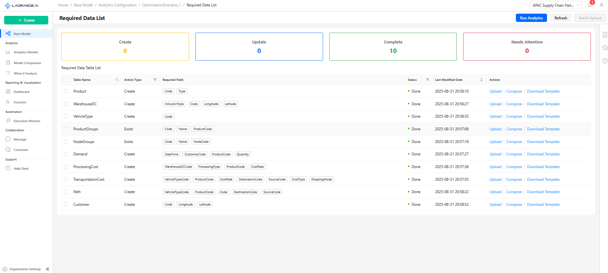{width="5.758514873140857in"
height="2.59in"}

When you click Run Analytics, a modal window opens to select the Model
Name. By default, the system pre-fills a suggested configuration name.
You can either accept this default or enter a custom name.

If the analytics has been run previously, the system will suggest
sequential names automatically, e.g., Configuration Name1, Configuration
Name2, etc., to help you keep track of multiple runs.

{width="5.766128608923885in"
height="2.5980938320209974in"}

## 2.16 Execution Monitoring

This page provides a real-time overview of your analytics execution.

**Execution Summary:**

- **Name:** The scenario name (e.g., OptimizationScenario_1)

- **Type:** Type of process (analytic)

- **Status:** Current execution status (running, completed, or failed)

- **Start Time:** When the analytics run began

- **Duration:** Elapsed time since the run started

- **Submitted By:** User who initiated the run

**Phase Details:**\
Each analytics run consists of multiple phases. For each phase, you can
view:

- **Phase Name:** Name of the phase (e.g., Analytics Run, Dashboard
  Creation)

- **Status:** Current status of the phase (running, completed, not
  started)

- **Start Time:** Phase start time

- **Duration:** Time elapsed for the phase

- **Actions:** Options such as **Download Logs** to review phase details

**Additional Options:**

- From the top of the page, you can **download logs** for the entire
  run.

- You can also **view model** that have been generated by the analytics
  run.

You can monitor progress in real time, download logs for
troubleshooting, and access newly created models immediately.

{width="5.887096456692913in"
height="2.6553258967629048in"}

{width="5.895160761154855in"
height="2.6432699037620297in"}

{width="5.919354768153981in"
height="2.6589129483814524in"}

### 2.16.1 Execution List

From the main page, you can access the **Execution List** to monitor all
analytics runs. This list provides an overview of each execution's name,
type, status, start time, duration, and available actions.

**Actions:**

- **View Details** → Opens detailed information for the selected
  execution, including phase statuses, logs, and any generated models.

This feature allows you to efficiently track, manage, and review all
analytics executions from one central location.

{width="5.919354768153981in"
height="2.6671358267716534in"}

## 2.17 Accessing Model Dashboards

You can access the dashboard for a created model in two ways:

1.  **From the Execution Details:** After running a model, click **View
    Model** to navigate to the model's page. This page mirrors the
    layout of the Base Model main page, where you can view the dashboard
    specifically generated for this model.

2.  **From the Base Model Dashboards:** When a model is run for the
    first time in a workspace, a default dashboard is automatically
    created for the Base Model. Additionally, by navigating to the
    **Dashboards** section of the Base Model, you can access all
    dashboards within the workspace.

**Dashboard Structure:**

- Each dashboard can contain multiple pages.

- Each page may include several charts, providing a comprehensive view
  of analytics and performance metrics.

### 2.17.1 Dashboards List

The **Dashboards** page provides a complete overview of all dashboards
in the workspace.

**Columns Displayed:**

- **Dashboard Name** -- The name of the dashboard

- **Associated Model/Group** -- The model or group linked to the
  dashboard

- **Last Modified Date** -- Date and time of the last update

- **Actions** -- Options to **View**, **Edit**, or **Delete** a
  dashboard

**Accessing Dashboard Details:**

- Clicking **View** on any dashboard allows you to explore its full
  structure, including all pages and the charts contained within each
  page.

- This lets you analyze metrics, visualize performance, and interact
  with the analytics content specific to that model or group.

{width="5.962121609798775in"
height="2.686406386701662in"}

### 2.17.2 Dashboard View

When you click **View** on a dashboard, you can see the complete
dashboard, including all its pages and the charts contained on each
page. This lets you explore all the visualizations and metrics
associated with that dashboard in full detail.

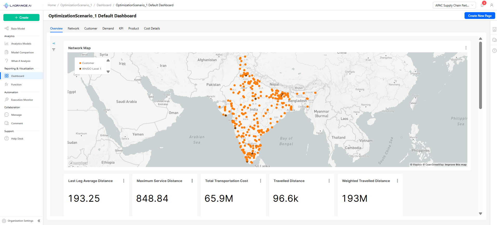{width="6.0in" height="2.723611111111111in"}

### 2.17.3 Dashboard Editing

This page allows users to modify existing dashboards, manage pages, and
configure charts. Users can access it by selecting **Edit** from the
**Actions** column in the **Dashboards List** page..

**PAGE MANAGEMENT (Left Panel)**

- Displays all pages in the dashboard (e.g., Overview, Network,
  Customer, Demand, KPI, Product, Cost Details).

- **Select Page**: Click a page to view or edit its charts.

- **Add New Page**: Button to create additional pages.

- **Reorder Pages**: Drag and drop pages to change their sequence.

- Visual feedback highlights the selected page.

**CHART MANAGEMENT (Right Panel)**

- Shows all charts associated with the selected page.

- Columns include:

  - **Title**: Name of the chart (editable).

  - **Chart Type**: Bar, Line, Pie, Table, Area, Tree, Funnel, Heatmap.

  - **Actions**: Edit or Remove the chart.

- **Add New Chart**: Button enabled only when a page is selected.

- **Edit Chart**: Modify chart properties, including title, function
  assignment, or chart type.

- **Remove Chart**: Deletes chart from the page (confirmation required).

**INTERACTIVE FEATURES**

- Multiple charts can be added per page.

- Drag-and-drop page reordering updates sequence automatically.

- No data will display if the page has no charts yet.

- Changes are applied either automatically or via the **Save** button.

- Visual indicators show which page and charts are currently selected.

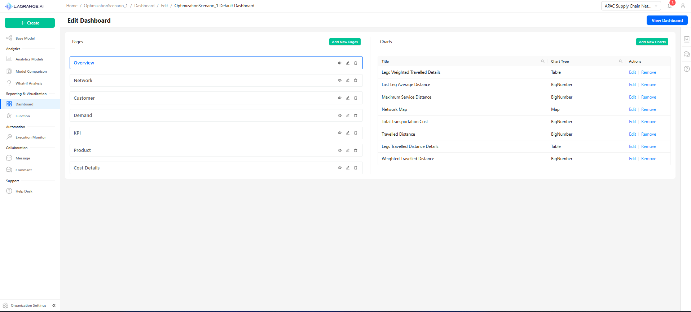{width="6.0in"
height="2.7152777777777777in"}

### 2.17.4 Add New Chart

This modal allows users to add charts to a selected dashboard page.

**FUNCTION SELECTION (Left Panel)**

- Displays a searchable and filterable table of available functions.

- Columns include:

  - **Function Name**: Name of the analytic or dataset function (e.g.,
    Cost Breakdown, Customer Data, Daily Demand).

  - **Categories**: Category associated with the function (e.g.,
    Network, Customer, Demand, Overview).

- Users can select a single function to create a chart.

- Filter and search options are available to quickly find the desired
  function.

**CHART CONFIGURATION (Right Panel)**

- **Chart Name**: Auto-populated based on the selected function; can be
  edited by the user.

- **Select Chart Types**: Choose the type(s) of visualization for the
  chart. Supported types include:

  - Bar Chart

  - Line Chart

  - Pie Chart

  - Table

  - Area Chart

  - Tree Chart

  - Funnel Chart

  - Heatmap

**INTERACTIVE FEATURES**

- Multiple chart types can be selected for the same function.

- Real-time validation ensures the chart name and type are specified
  before submission.

- Modal includes **Save** and **Cancel** buttons with loading states
  during processing.

- After saving, the chart is added to the selected page and visible in
  the dashboard editor.

> {width="6.145160761154855in"
> height="2.778124453193351in"}

# 3. Workspace Management

## 3.1 Overview

Multi-tenant workspace system enabling organized supply chain analytics
with visual workspace identification, quick access features, and
comprehensive organization management.

## 3.2 Welcome Interface

Welcome to Lagrange! Leverage AI for resilient & sustainable supply
chain networks.

Key Components:

- Organization Settings (Admin only) - policies

- User Settings - Profile, notifications, security

- Create Workspace

- Quick Access

{width="5.790322615923009in"
height="2.5841983814523184in"}

## 3.3 Workspace Display

{width="3.975in"
height="2.59992782152231in"}

## 3.4 Workspace Actions

Dropdown Menu: Preview, Delete (confirmation required) Click Actions:
Single click to navigate to workspace and set it as active

{width="4.116010498687664in"
height="2.683333333333333in"}

## 3.5 Quick Access

Quick Access Panel includes recent models, frequently used dashboards,
bookmarked reports, and saved comparisons. Features: Auto-populated, pin
frequently used resources, workspace-specific bookmarks

{width="3.558333333333333in"
height="2.440149825021872in"}

## 3.6 Workspace Creation

Create Workspace Modal - Required Fields:

- Workspace Title - Unique, descriptive name

- Description (Optional) - Purpose and scope, key objectives

- Workspace Members - Multi-select from organization users

- Creation Process: Open modal → Fill info → Submit & Confirm

{width="2.5996576990376203in"
height="2.2805555555555554in"} {width="2.566793525809274in"
height="2.3in"}

## 3.7 Organization Settings

Includes the following features:

- **Overview** -- High-level summary of your organization's activity and
  key metrics.

- **Workspaces** -- Manage, create, and configure all organizational
  workspaces[.]{dir="rtl"}

- **Users** -- Add, remove, and manage user roles and
  permissions[.]{dir="rtl"}

- **Policies** -- Define and enforce organization-wide rules and
  security settings[.]{dir="rtl"}

{width="5.903226159230096in"
height="2.6475688976377953in"}

##  [[]{#_Toc207630217 .anchor}]{dir="rtl"}3.8 Overview

Displays general information and key details about the organization.

{width="6.0in"
height="1.136111111111111in"}

## 3.9 Workspace Management 

The Management Table includes title, description, created by, date, last
modified, and actions. Administrative Actions: Edit workspace, Delete
workspace.

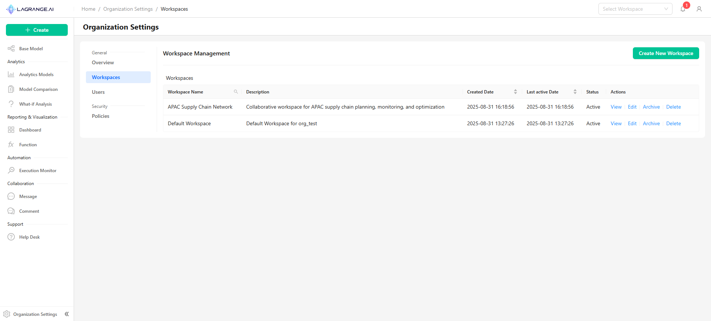{width="5.970370734908136in"
height="2.7025612423447067in"}

## 3.10 User Management

Displays user information and roles within the organization, with
options to edit, activate, or deactivate users.

{width="6.0in"
height="2.720833333333333in"}

## 3.11 Policies

Manage organization policies, with options to enable or disable them as
needed[.]{dir="rtl"}

{width="6.081481846019248in"
height="2.746522309711286in"}

## 3.12 Common Workflows

### 3.12.1 Creating New Workspace

Navigate to Management → Create Workspace → Configure Workspace → Invite
Team

### 3.12.2 Accessing Workspace

From Home Page or Quick Access → Select workspace → Auto-navigates to
base model

### 3.12.3 Managing Members

Add Members → Edit workspace → Select users → Assign roles → Save
changes

Remove Members → Edit workspace → Deselect users → Confirm removal →
Update permissions

## 3.13 Common Issues & Solutions

- Cannot create workspace → Check plan limits or permissions

- Duplicate name error → Use unique workspace name

- Members not appearing → Verify organization membership

- Delete confirmation fails → Type exact workspace name

- Color not displaying → Refresh page or clear cache

- Quick access empty → Start using workspaces to populate
